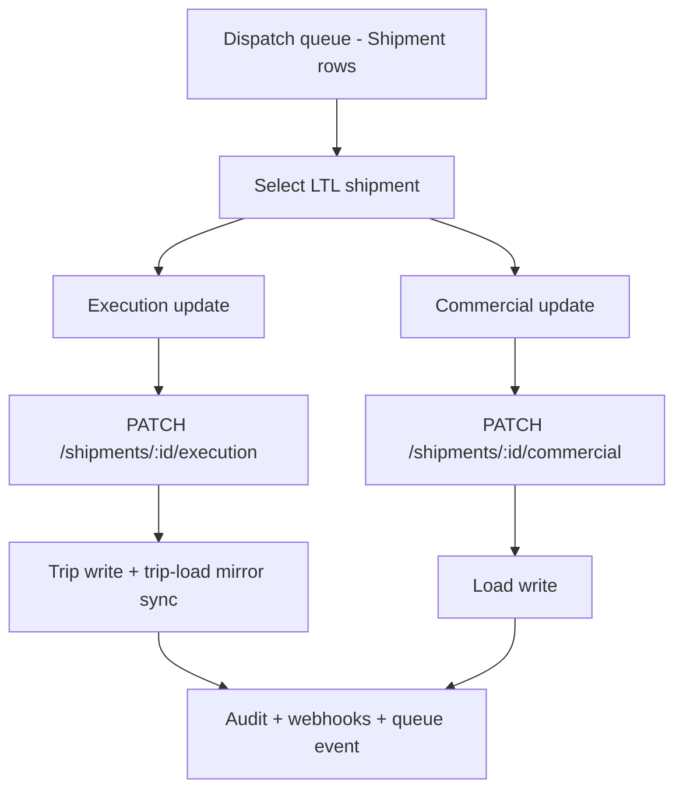
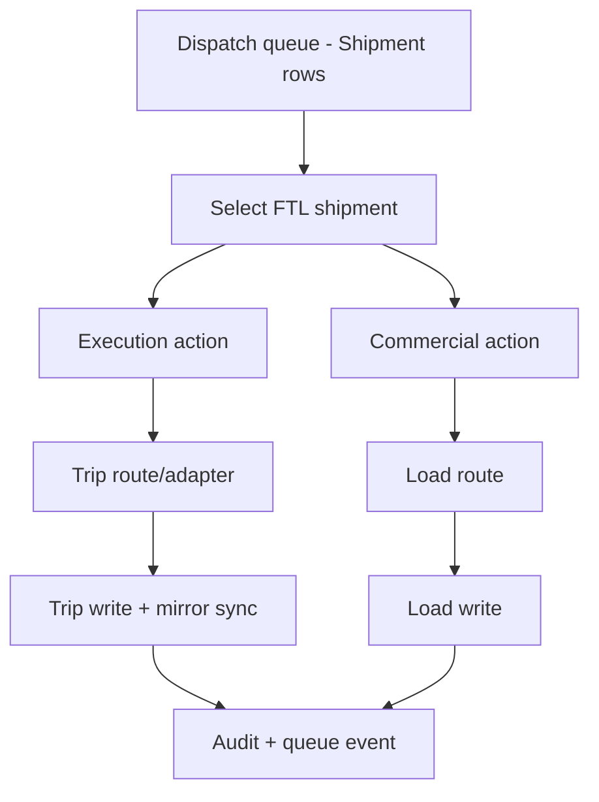
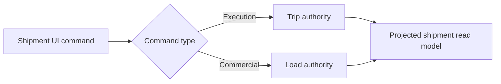

# Dispatch Shipment Workbench Blueprint

Last updated: March 4, 2026

## Goal

Reduce operator confusion by exposing a single dispatch object: **Shipment**.

- Dispatch users should not need to choose between Loads vs Trips.
- The screen should support both **FTL** and **LTL** in one queue.
- Domain truth remains split:
  - **Execution authority**: Trip
  - **Commercial authority**: Load

## Current UX contract

1. `/dispatch` is a single shipment-first workspace.
2. Movement mode selector exists at top-level:
   - `All modes`
   - `LTL`
   - `FTL`
3. LTL-only ownership lanes (`All lanes / Outbound / Inbound`) are hidden while viewing FTL-only mode.
4. Core quick controls remain visible: map, create shipment, queue view, mode, refresh.
5. Advanced controls remain under Workbench Controls menu.

## Business workflow diagrams

### LTL workflow

### FTL workflow

### Authority boundary

## Why this reduces confusion

1. One top-level object in dispatch (`Shipment`) removes dual mental model switching.
2. Operators keep one queue regardless of movement mode.
3. FTL and LTL differ by rules, not by separate top-level pages.
4. Advanced controls are available but no longer dominate primary actions.

## Next UX hardening steps

1. Replace `Load #` header label with `Shipment #` in dispatch grid.
2. Move low-frequency toolbar actions into Workbench Controls menu.
3. Add role-specific row primary CTA (`Assign`, `Advance status`, `Resolve exception`).
4. Keep one expandable row detail with tabs: `Execution`, `Commercial`, `Timeline`.
